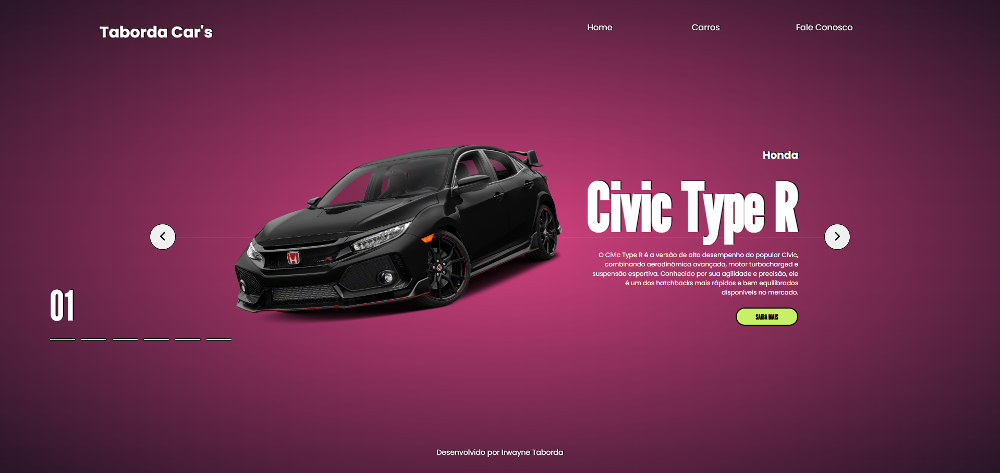

# 🚗 Projeto Cars
Um projeto de carrossel interativo de carros, desenvolvido com **HTML, CSS e JavaScript**, que permite navegar entre diferentes modelos de veículos com uma interface visual agradável.

## 📸 Preview
 <!-- Atualize esse caminho se necessário -->

## 🛠 Tecnologias Utilizadas
- HTML
- CSS
- JavaScript

## 🎯 Funcionalidades
- Navegação entre os itens do carrossel com botões "anterior" e "próximo"
- Destaque visual do item ativo
- Indicador de posição com pontos e número atual
- Botão de ação “Saiba Mais” em cada item

## 👨‍💻 Desenvolvido por
**Irwayne Taborda**  
[LinkedIn](https://www.linkedin.com/in/irwaynetaborda/)
